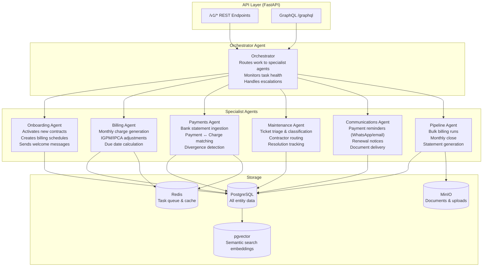

# AI Agent Architecture

RealState OS ships an embedded fleet of autonomous AI agents that handle long-running, multi-step operational work. All agents are supervised: they produce auditable `AgentTask` records, emit webhook events, and escalate to humans when confidence is low.

---

## Architecture Overview



---

## Agent Descriptions

### Orchestrator Agent

The orchestrator is the entry point for all agent work. It:

- Receives task requests from the API
- Routes to the correct specialist agent based on task type
- Monitors running tasks and handles timeouts
- Escalates to human review when agent confidence falls below threshold
- Aggregates results and updates the `AgentTask` record

### Onboarding Agent

Triggered when a new contract is created. Performs:

1. Data completeness validation (property, owner, renter profiles)
2. Document checklist generation
3. Billing schedule creation for the contract duration
4. Initial charge generation for the first month
5. Welcome email to renter and owner

**Trigger:** `POST /v1/contracts` (automatic)
**Duration:** 30s–2min depending on data completeness

### Billing Agent

Generates monthly rent charges for all active contracts. Performs:

1. For each active contract: resolve due date (respecting weekends and Brazilian holidays)
2. Calculate any pending IGPM/IPCA adjustment
3. Apply early-payment discounts if configured
4. Create `Charge` record with full composition breakdown
5. Emit `charge.created` webhook event

**Trigger:** Monthly cron (1st of month) or `POST /v1/billing/generate`
**Duration:** Scales linearly with contract count (~50ms/contract)

### Payments Agent

Ingests bank statements and reconciles payments to charges. Performs:

1. Parse bank statement (CSV/OFX/CNAB240)
2. Match each payment to open charges using: amount, renter CPF, property code
3. Mark charges as `paid`, `partial`, or `overpayment`
4. Flag unmatched or divergent payments for human review
5. Generate monthly reconciliation statement

**Trigger:** `POST /v1/payments/import` or automatic bank polling
**Duration:** 1–10min depending on statement size

### Maintenance Agent

Triages and routes maintenance tickets. Performs:

1. Classify ticket urgency (emergency / high / medium / low) using keyword analysis
2. Extract problem category (plumbing, electrical, structural, etc.)
3. Route to appropriate contractor based on category and location
4. Set SLA deadline based on urgency
5. Send acknowledgment to renter

**Trigger:** `POST /v1/maintenance` (automatic on creation)
**Duration:** 5–15s

### Communications Agent

Sends automated messages at the right time. Handles:

- **3 days before due date:** Payment reminder via WhatsApp + email
- **1 day overdue:** Late payment notice with bank details
- **7 days overdue:** Formal notice with legal reference
- **90 days before lease end:** Renewal proposal
- **On maintenance resolution:** Satisfaction survey

**Trigger:** Scheduled cron + event hooks
**Duration:** Near-real-time (< 5s per message)

---

## AgentTask Resource

Every agent run creates an `AgentTask` record for full auditability:

```json
{
  "id": "task_01HX...",
  "tenant_id": "acme-corp",
  "agent": "billing_agent",
  "task_type": "generate_monthly_charges",
  "status": "completed",
  "input": {
    "reference_month": "2024-02",
    "contract_ids": ["ctr_01HX...", "ctr_02HX..."]
  },
  "output": {
    "charges_created": 47,
    "total_amount": "142350.00",
    "errors": []
  },
  "started_at": "2024-02-01T00:00:00Z",
  "completed_at": "2024-02-01T00:02:21Z",
  "duration_ms": 141000,
  "confidence": 0.98,
  "human_review_required": false
}
```

### Task Statuses

| Status | Description |
|--------|-------------|
| `pending` | Queued, not yet started |
| `running` | Currently executing |
| `completed` | Finished successfully |
| `failed` | Failed after all retries |
| `escalated` | Requires human review |

---

## Monitoring Agent Work

```bash
# List recent agent tasks
GET /v1/agent-tasks?status=running

# Get a specific task
GET /v1/agent-tasks/{task_id}

# Stream real-time updates (Server-Sent Events)
GET /v1/agent-tasks/{task_id}/stream
```

### GraphQL Subscription (real-time)

```graphql
subscription {
  agentTaskUpdated(taskId: "task_01HX...") {
    id
    status
    output
    completedAt
  }
}
```

---

## Human Escalation

When an agent's confidence score falls below **0.85**, or when it encounters an ambiguous case (e.g. payment amount within 5% but not exact), it:

1. Sets `human_review_required: true` on the `AgentTask`
2. Emits `agent_task.escalated` webhook event
3. Creates a review item in the Operations dashboard
4. Pauses further automated processing on the affected resource

A human operator reviews and approves or corrects the decision, after which the agent resumes.

---

## Tool Inventory

Each agent has access to a defined set of tools:

| Tool | Agents |
|------|--------|
| `create_charge` | Billing Agent |
| `update_charge_status` | Billing Agent, Payments Agent |
| `match_payment_to_charge` | Payments Agent |
| `classify_ticket` | Maintenance Agent |
| `route_to_contractor` | Maintenance Agent |
| `send_whatsapp` | Communications Agent |
| `send_email` | Communications Agent |
| `generate_pdf` | Pipelines Agent |
| `query_igpm_rate` | Billing Agent |
| `query_ipca_rate` | Billing Agent |
| `semantic_search` | Orchestrator, all agents |
