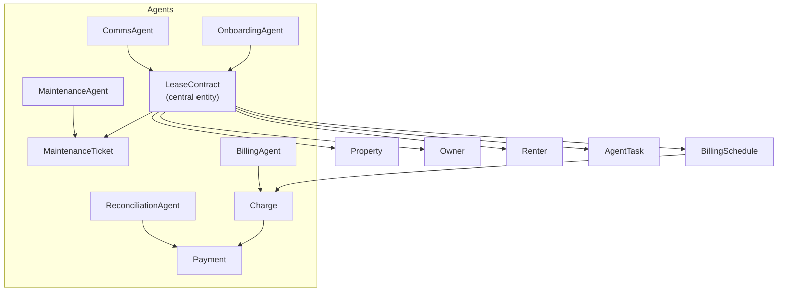

# RealState OS API

**Production-grade multi-tenant SaaS for Brazilian real estate management.**

RealState OS is a contract-first platform that automates the full rental lifecycle: onboarding, billing, payment reconciliation, maintenance, communications, and AI-powered operations. It exposes a RESTful HTTP API and a GraphQL layer, backed by a fleet of autonomous AI agents.

---

## Quick Start

```bash
# 1. Get an access token
curl -X POST https://api.realstateos.io/auth/token \
  -H "Content-Type: application/json" \
  -d '{"tenant_id": "your-org-id", "email": "you@company.com"}'

# 2. Call any endpoint
curl https://api.realstateos.io/v1/contracts \
  -H "Authorization: Bearer <token>"
```

---

## Base URL

| Environment | URL |
|-------------|-----|
| Production  | `https://api.realstateos.io` |
| Staging     | `https://api-staging.realstateos.io` |
| Local dev   | `http://localhost:8000` |

All versioned endpoints are prefixed with `/v1/`.

---

## Key Concepts

### Multi-tenancy

Every resource is scoped to an **organization** (`tenant_id`). Your JWT encodes the tenant context — you can only see and modify data belonging to your organization. There is no way to access another tenant's data through the API.

### Contract-First

The platform is built around `LeaseContract` as the central entity. Properties, owners, renters, billing schedules, charges, and payments all attach to a contract. Onboarding a new contract triggers the full operational workflow automatically.

### AI Agents

Autonomous agents handle long-running work asynchronously: billing generation, payment reconciliation, IGPM/IPCA adjustments, maintenance triage, renter communications, and lease renewals. All agent work is auditable through the `AgentTask` resource.

---

## Domain Overview



---

## Rate Limits

| Tier | Requests / minute | Burst |
|------|--------------------|-------|
| Free | 60 | 10 |
| Pro  | 600 | 50 |
| Enterprise | Unlimited | — |

Rate limit headers are returned on every response:

```
X-RateLimit-Limit: 600
X-RateLimit-Remaining: 598
X-RateLimit-Reset: 1710000060
```

Exceeding the limit returns `429 Too Many Requests`.

---

## Pagination

List endpoints support cursor-based pagination via `page` and `per_page` query parameters.

```json
{
  "items": [...],
  "total": 142,
  "page": 1,
  "per_page": 20,
  "pages": 8
}
```

---

## Error Format

All errors follow a consistent structure:

```json
{
  "detail": "Tenant not found or access denied"
}
```

| Status | Meaning |
|--------|---------|
| `400` | Validation error — check `detail` for field errors |
| `401` | Missing or invalid JWT |
| `403` | Authenticated but not authorized for this resource |
| `404` | Resource not found |
| `409` | Conflict — e.g. duplicate contract |
| `422` | Unprocessable entity — schema violation |
| `429` | Rate limit exceeded |
| `500` | Internal server error |

---

## OpenAPI / Swagger

Interactive API explorer available at:

- **Swagger UI**: `http://localhost:8000/docs`
- **ReDoc**: `http://localhost:8000/redoc`
- **OpenAPI JSON**: `http://localhost:8000/openapi.json`
