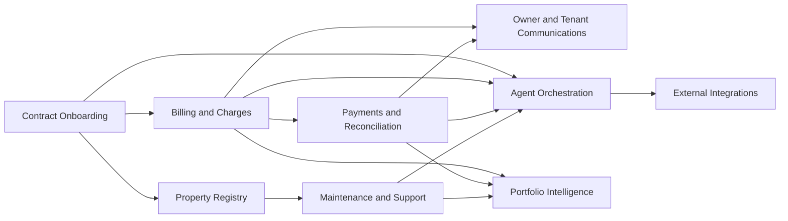

# Arquitetura Inicial

## 1. Objetivo

Este documento define a arquitetura inicial do Real Estate OS como plataforma de operacao de locacoes. Ele estabelece limites de dominio, entidades canonicas, contratos de integracao, eventos de dominio e regras de seguranca que vao guiar a implementacao futura.

## 2. Principios de Arquitetura

- contract-first: todo fluxo comeca a partir de um contrato de locacao assinado
- contexto operacional primeiro: registros, tarefas e mensagens sempre precisam estar ligados a uma entidade de negocio
- IA com supervisao: agentes executam trabalho, mas nunca contornam auditoria ou escalonamento
- sistemas externos sao nao confiaveis por padrao: toda integracao precisa de retry, monitoramento e fallback
- rastreabilidade financeira e inegociavel: calculos, emissao, pagamentos e ajustes precisam de historico

## 3. Bounded Contexts

### Contract Onboarding

Responsavel por transformar o contrato assinado e as entradas minimas em um registro operacional de locacao.

Saidas centrais:

- `LeaseContract`
- `Property`, `Owner` e `Tenant` vinculados
- tarefas de onboarding pendentes

### Property Registry

Mantem o cadastro canonico do imovel e a relacao entre ativo, partes e historico contratual.

Saidas centrais:

- metadados normalizados do imovel
- referencias de propriedade e ocupacao
- documentos operacionais vinculados

### Billing & Charges

Controla agenda de cobranca, calculo mensal, emissao e estado de ciclo da cobranca.

Saidas centrais:

- `BillingSchedule`
- `Charge` mensal
- excecoes financeiras

### Payments & Reconciliation

Controla ingestao de pagamentos, matching, analise de divergencia e geracao de demonstrativos.

Saidas centrais:

- `Payment`
- decisoes de conciliacao
- `Statement`

### Owner & Tenant Communications

Controla comunicacao de saida disparada por contrato, cobranca, pagamento ou manutencao.

Saidas centrais:

- registros de mensagem
- status de entrega
- templates e logs de comunicacao

### Maintenance & Support

Controla abertura, triagem, atribuicao e historico de resolucao de chamados.

Saidas centrais:

- `MaintenanceTicket`
- historico de atendimento
- fila de excecoes nao resolvidas

### Agent Orchestration

Controla execucao automatizada, retries, confianca, falhas e escalonamentos.

Saidas centrais:

- `AgentTask`
- logs de execucao
- registros de escalonamento

### External Integrations

Controla adaptadores para bancos, prefeituras, sistemas de condominio, OCR, canais de comunicacao e fontes documentais.

Saidas centrais:

- estado de saude dos conectores
- resultados de sincronizacao
- payloads externos normalizados

### Portfolio Intelligence

Controla metricas agregadas, dashboards operacionais, visao de inadimplencia e relatorios de performance.

Saidas centrais:

- metricas de carteira
- relatorios de tendencia
- resumos operacionais

## 4. Relacao entre Contextos

## 5. Entidades Canonicas

### `Property`

Representa o ativo administrado.

Campos sugeridos:

- `id`
- `address`
- `property_type`
- `area_sqm`
- `bedrooms`
- `bathrooms`
- `parking_spots`
- `registry_reference`
- `status`

### `Owner`

Representa o proprietario legal ou beneficiario que recebe atualizacoes e demonstrativos.

Campos sugeridos:

- `id`
- `full_name`
- `document_number`
- `contact_channels`
- `payout_preferences`
- `status`

### `Tenant`

Representa o inquilino responsavel por pagamentos e solicitacoes de manutencao.

Campos sugeridos:

- `id`
- `full_name`
- `document_number`
- `contact_channels`
- `guarantee_profile`
- `status`

### `LeaseContract`

Representa o contrato assinado e seu estado operacional.

Campos obrigatorios:

- `id`
- `property_id`
- `owner_id`
- `tenant_id`
- `start_date`
- `end_date`
- `rent_amount`
- `deposit_or_guarantee_type`
- `charge_rules`
- `pass_through_rules`
- `payout_rules`
- `operational_status`

### `BillingSchedule`

Representa regras recorrentes de cobranca, e nao as instancias mensais.

Campos obrigatorios:

- `id`
- `lease_contract_id`
- `due_date_rule`
- `billing_window_rule`
- `charge_components`
- `collection_method`
- `late_fee_rule`
- `interest_rule`
- `status`

### `Charge`

Representa uma cobranca mensal gerada a partir da agenda de cobranca.

Campos obrigatorios:

- `id`
- `lease_contract_id`
- `billing_period`
- `line_items`
- `gross_amount`
- `discount_amount`
- `penalty_amount`
- `net_amount`
- `issue_status`
- `payment_status`
- `second_copy_count`

Tipos suportados de item:

- rent
- condominium
- IPTU
- extra fee
- penalty
- interest
- discount

### `Payment`

Representa um recebimento financeiro a ser conciliado com uma ou mais cobrancas.

Campos obrigatorios:

- `id`
- `charge_id`
- `received_amount`
- `received_at`
- `payment_method`
- `bank_reference`
- `reconciliation_status`
- `divergence_reason`

### `Statement`

Representa o demonstrativo do proprietario para um contrato ou periodo da carteira.

Campos obrigatorios:

- `id`
- `owner_id`
- `lease_contract_id`
- `period`
- `entries`
- `generated_at`
- `delivery_status`

### `MaintenanceTicket`

Representa um problema de suporte ou manutencao associado ao imovel ou contrato.

Campos obrigatorios:

- `id`
- `lease_contract_id`
- `property_id`
- `opened_by`
- `category`
- `priority`
- `status`
- `resolution_summary`

### `Document`

Representa documentos operacionais enviados, gerados ou buscados externamente.

Campos obrigatorios:

- `id`
- `entity_type`
- `entity_id`
- `document_type`
- `source`
- `storage_reference`
- `parsed_status`
- `confidence_score`

### `AgentTask`

Representa uma tarefa executada por maquina com metadados de supervisao.

Campos obrigatorios:

- `id`
- `task_type`
- `status`
- `input`
- `output`
- `confidence`
- `failure_reason`
- `escalation_target`
- `related_entity_type`
- `related_entity_id`
- `attempt_count`

### `IntegrationConnector`

Representa a configuracao e o estado de execucao de um adaptador externo.

Campos obrigatorios:

- `id`
- `provider_name`
- `capabilities`
- `required_inputs`
- `auth_mode`
- `sync_frequency`
- `retry_policy`
- `last_sync_status`
- `last_sync_at`

## 6. Eventos de Dominio

Conjunto minimo de eventos:

- `contract_onboarded`
- `contract_activation_blocked`
- `charge_calculated`
- `charge_issued`
- `payment_received`
- `payment_reconciled`
- `payment_divergence_detected`
- `integration_failed`
- `human_task_created`
- `maintenance_opened`
- `maintenance_closed`

Regras de desenho dos eventos:

- cada evento referencia a entidade principal de negocio
- cada evento registra timestamp e tipo de ator
- eventos que disparam automacao precisam ser idempotentes

## 7. Estados Operacionais

### `LeaseContract.operational_status`

- `pending_onboarding`
- `active`
- `suspended`
- `terminated`

### `Charge.issue_status`

- `draft`
- `ready_to_issue`
- `issued`
- `failed`

### `Charge.payment_status`

- `open`
- `partially_paid`
- `paid`
- `overdue`
- `written_off`

### `MaintenanceTicket.status`

- `open`
- `triaged`
- `in_progress`
- `waiting_external`
- `resolved`
- `closed`

### `AgentTask.status`

- `queued`
- `running`
- `completed`
- `failed`
- `escalated`
- `cancelled`

## 8. Contrato de Integracao

Todo conector deve declarar:

- `capabilities` suportadas
- `required_inputs` minimos
- `auth_mode`
- `sync_frequency`
- `retry_policy`
- status observavel de execucao

Categorias iniciais de integracao:

- bancos e cobranca
- consulta municipal e de tributos
- ingestao de documentos de condominio
- OCR e parsing documental
- e-mail, WhatsApp e canais de mensageria

## 9. Automacao e Fallback Humano

Os agentes podem:

- extrair dados estruturados de documentos
- buscar insumos de cobranca recorrente
- preparar e emitir cobrancas mensais
- monitorar confirmacoes de pagamento
- enviar comunicacoes a inquilino e proprietario
- classificar e encaminhar manutencao

Os agentes devem escalar quando:

- a confianca estiver abaixo do limite
- faltar insumo obrigatorio
- a fonte externa estiver indisponivel
- a regra de negocio estiver ambigua
- a divergencia financeira nao puder ser resolvida deterministicamente

O payload de escalonamento deve incluir:

- acao tentada
- insumos coletados
- saida parcial
- motivo da falha
- proximo passo recomendado

## 10. Observabilidade e Auditoria

A arquitetura precisa preservar:

- quem ou o que executou cada acao
- a origem de cada campo financeiro ou contratual
- versoes de documentos parseados ou gerados
- resultado de entrega das comunicacoes
- retries, falhas e decisoes de escalonamento

Informacoes sensiveis nunca devem ser emitidas em logs em texto puro.

## 11. Notas para Implementacao Futura

- construir a primeira versao apenas em torno de contratos residenciais ativos
- manter aquisicao e fluxos pre-contrato fora do dominio principal por enquanto
- modelar regras de cobranca separadamente das cobrancas mensais para nao acoplar calculo e emissao
- tratar execucao de agentes como subsistema operacional de primeira classe, nao como detalhe de background
